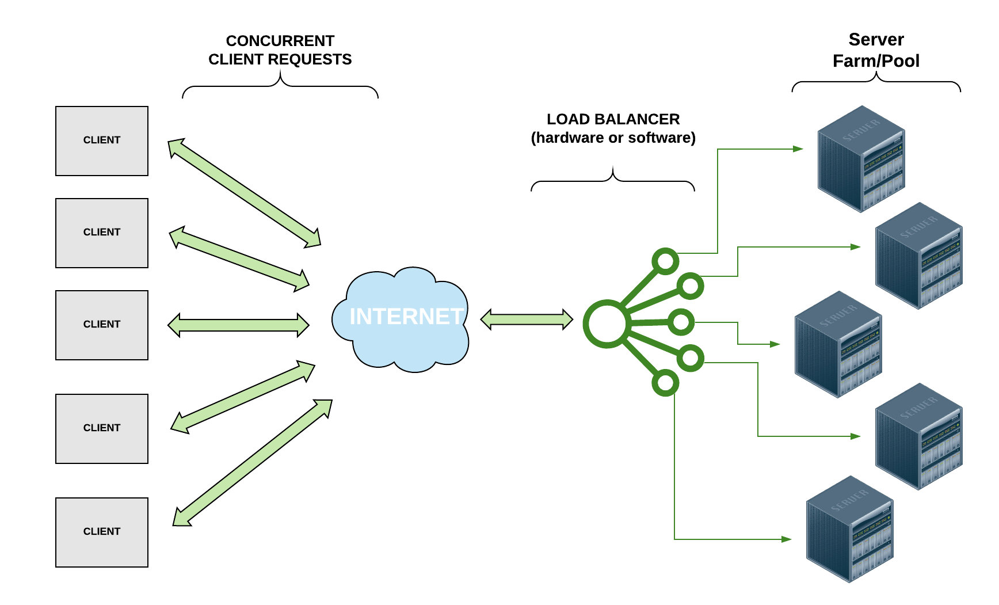

*by:* Ethan Baron and Catherine Meadows

## Analysis of NGINX Load Balancing performance compared to NGINX Load Balancing with Consul Template.

---

## Load Balancing 
Think about some of the most popular websites in today’s society and the amount of traffic that they receive at any given time. As of 2020, YouTube alone is estimated to receive over 1.5 billion visits per month1. In order to handle such high volumes of traffic, multiple servers are typically used to meet this demand in order to handle client requests concurrently. But what happens when a server goes down or a new server is added? And how do we make sure that all of the requests are not given to a single server? This is why we need *load balancing*.

Take a look at the diagram and notice how the load balancer distributes the client requests to multiple servers so that, even though multiple requests are being sent at the same time, they can all be handled efficiently rather than one at a time. 

Load balancing processes allow us to distribute network traffic and client requests across multiple servers, hence balancing the load of work to ensure that no server is bogged down by requests and to increase efficiency of the overall system. In addition to distributing the work evenly across servers, if a server goes down, a load balancer can halt sending requests to that server, increasing the reliability of the system. Likewise, if a new server is added, a load balancer can immediately begin directing traffic to it. Thus, load balancers make it easier to scale systems through the addition of resources. 

Depending on the system’s needs, load balancers use various different load balancing algorithms. Some common load balancing algorithms2 include:
* “Round Robin” : Requests are directed to servers sequentially; This is the default algorithm for many load balancers and is a simple load balancing implementation but fails to account for the number of connections a server currently has.
* Server with the least number of connections : The request is directed to the server with the least number of current connections.
* IP Hash : A hash is performed on the client’s IP address to determine which server to distribute the request to. 

Load balancers can either be hardware or software. For a hardware-based load balancer, the load balancing software is loaded onto a specialized machine. While still effective, it can be expensive and can make scaling difficult. If traffic increases, more load balancing processors have to be bought, loaded with the load balancing software, and installed to handle the higher demand. Thus, software load balancers that run on commodity hardware are ideal for systems that need to be flexible in scaling.

## NGINX 

[NGINX](https://www.nginx.com) is an open source web server that offers, among other services, software-based load balancing. Many high-traffic websites like Netflix and Dropbox use NGINX/NGINX Plus to efficiently direct web traffic. NGINX uses the Round Robin method by default for load balancing but allows the user to specify another algorithm to accommodate the user’s needs. 

### Investigation

## Consul
[Consul](https://www.consul.io) is a software service networking tool that offers a plethora of services, including dynamic load balancing. Consul offers [Consul Template](https://learn.hashicorp.com/consul/integrations/nginx-consul-template) which can be used in conjunction with NGINX to improve performance by performing health checks and automatically updating your NGINX configuration file. As you can see in the diagram below, when running a Consul client agent on the same instance as your NGINX load balancer, the Consul Template works in between the data center and the load balancer to update the NGINX load balancer configuration file to account for servers that are offline. By performing these health checks and auto updating the load balancer to direct traffic only to the healthy servers, it should enhance performance by eliminating the time that the NGINX load balancer would typically consume in waiting for a response from a server that is offline (NGINX typically waits about 60 seconds before determining that a server is offline).  

---
Footnotes
1) https://ahrefs.com/blog/most-visited-websites/
2) https://www.nginx.com/resources/glossary/load-balancing/
