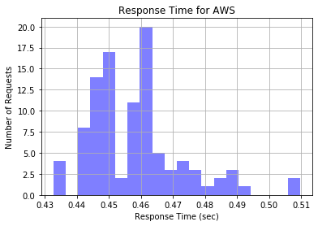
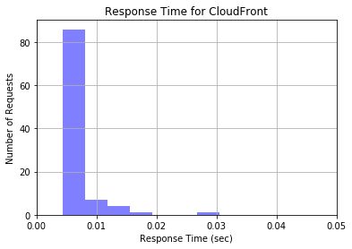

*by:* Benjamin DeVierno and Ethan Baron

Comparison of Amazon S3 and Amazon CloudFront as CDN providers.

---

<link type="text/css" rel="stylesheet" href="/assets/css/lightslider.min.css" />
<script src="https://ajax.googleapis.com/ajax/libs/jquery/1.11.0/jquery.min.js"></script>
<script src="/assets/js/ligrun.sh
htslider.min.js"></script>


## A Brief History about CDNs

Before I dive directly into Amazon Cloudfront I thought it would be useful to the reader to familiarize themselves with the origins of Amazon Cloudfront. They are based on Content Delivery Networks or CDNs. This technology has been around for quite some time now. They were first developed in the late 90's to address higher demand for video and audio streaming and the ever growing content on the web. Other technologies such as server farms and hierarchical caching played instrumental roles in paving the ground of building the infrastructure that supported the advent of the internet boom.

## Benefits of CDNs. How does it work?

Now you may be wondering why are CDNs important and how do they benefit me? Before CDNs, we would have to retrieve static data from the origin each time a user requested. Naturally, this created many inefficiency and latency issues which only get exacerbated as more users make request to the server. CDNs, allow us to cache data that are frequently requested. What this means is that when you search for cute pictures of cats you will be able to view those adorable animals at a much greater speeds.

## Amazon Cloudfront History. How does it work?

Amazon launched their own CDN CloudFront in 2008. Amazon's global network have now amassed a staggering 205 data centers which they call 'Edge Locations' in 84 cities across 42 countries. When a user makes a request with Amazon CloudFront, the request will initially be sent to the nearest Edge Location from the user. If the information that they have requested has already been cached at that Edge Location, the user will then receive a response. If the information has yet been cached, Cloudfront will retrieve the network packets from the origin.

For example, if a user located in Singapore makes a request to a web server in California our network packets will have to circumvent the globe before they receive an acknowledgement. If the web server was hosted with Cloudfront the request only has to travel as far as one the nearest edge location located in Kuala Lumpur, Malaysia.


## Amazon Cloudfront vs Regular S3

For the purpose of this blog I have created two sites. One hosted on CloudFront and the other on a regular S3. S3 is a service offered by AWS 'that provides object storage through a web service interface.' In other terms it is where our two sites are going to be hosted.

[Tea Cup Cat site hosted on S3](http://bendogpicture.s3-website-ap-southeast-1.amazonaws.com/)

[Tea Cup Cat site hosted on CloudFront](http://d14mfeaqszawbm.cloudfront.net/)

Note: I created the buckets in Singapore and I am running our network speed tests in Washington DC. Why did I choose Singapore? Well, it is reasonably far away so hopefully we should be able to see some considerable performance benefits achieve through using CloudFront.

## Investigation

#### Overview

Through this investigation, we configured both an Amazon S3 server and an Amazon CloudFront server for use as a CDN. The landing page for both servers contained a single image of a small cat. The script we wrote sent 100 requests (a relatively small sample size, but significant nonetheless) to each server and generated a histogram of the relative response time ranges. The "response time" as described in our results refers to the amount of time the website took to load the image through the web request. 

#### Script and Environment

The scripts were created in Python on a [Jupyter](https://jupyter.org/) notebook running from an AWS Cloud9 instance. For information on installing Jupyter, see [this link](https://jupyter.org/install) and for information on configuring Cloud9, see [this link](https://docs.aws.amazon.com/cloud9/latest/user-guide/setting-up.html). Our script utilized several libraries, including pandas, numpy, matplotlib, seaborn, requests, and time. To install all of these packages, execute the following pip command:

```
# Use pip with current python version to install packages
python -m pip install jupyter numpy scipy pandas matplotlib seaborn
```

Ensure that you have a port open on which you can run Jupyter. For this investigation, we opened and used port 8080 on Cloud9. After ensuring that you have a port available, run Jupyter on your Cloud9 instance by executing the following command in the console:

```
# run jupyter on port 8080
ipython3 notebook --ip=0.0.0.0 —port=8080 --no-browser
```

The script we used for the investigation is provided below:

```
# Import required packages
import pandas as pd
import numpy as np
import matplotlib.pyplot as plt
import seaborn as sns
import requests
import time

# Set url for requests
data_url = 'url-goes-here'
# Create empty list for values
x = np.array([])
# Send 100 requests
for i in range(0, 100) :
    # Keep track of request start time
    start = time.time()
    # Make request to url
    r = requests.get(data_url)
    # Calculate amount of time elapsed in request
    elapsed = time.time() - start
    # Add new data point to list
    x = np.append(x, elapsed)
    # Pause for one second
    time.sleep(1)

# Define histogram variables
num_bins = 20
# Plot data on histogram
n, bins, patches = plt.hist(x, num_bins, facecolor='blue', alpha=0.5)
# Set axis labels and title
plt.ylabel('Number of Requests')
plt.xlabel('Response Time (sec)')
plt.title('Response Time for CloudFront')
# Show grid on histogram
plt.grid(True)
# Set limit to remove outlier points
plt.xlim(0, 0.2)
# Display the histogram in Jupyter
plt.show()
```

#### Controlling for Other Variables

The request script runs 100 times and pauses for one second after each request. The pause is useful to ensure that there are no latency-related issues that might influence the results observed. 100 requests are performed to ensure that the sample size is sufficient and that there are unlikely to be any outlier results in the observation set.

The same image was used on both the AWS server and the Amazon CloudFront CDN server. This eliminates differences in request times that would be attributed to the size, type, or pixel ranges in the image. This ensures that the only differences observed between requests made to each server are attributable to the server structure itself.

#### Results

The output of this script, run for the Amazon S3 and Amazon CloudFront urls, is a histogram. The histograms for each service are included below.




Based on the results, we can see that using Amazon CloudFront as a CDN for web requests is much faster than using Amazon S3. Keep in mind that while the histograms may appear similar, the scales are vastly different; the request time for Amazon CloudFront ranges from 0.005 to 0.03 seconds, while the request time for Amazon S3 ranges from 0.43 to 0.51 seconds. This shows a very significant difference in web request time between the two CDN providers. 

## Conclusion

I hope that after reading this blog you have become just as excited about CloudFront or CDNs as I am. If not maybe learnt something about how infrastructure and CDNs support the ever growing volume of data on the internet and increase the quality of the User Experience. At the very least you got to see some cute animals.


https://aws.amazon.com/cloudfront/features/
https://aws.amazon.com/s3/
