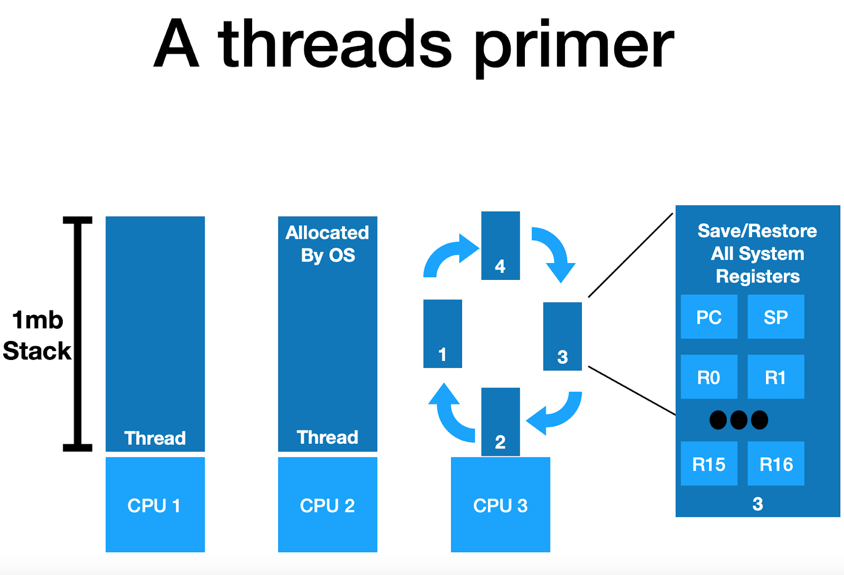
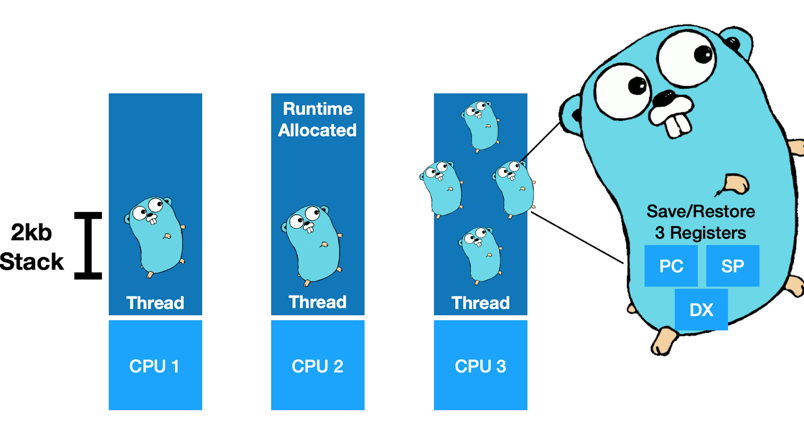

*by:* xiaosu lyu, cuidi wei and huadong hu


This is a short blog talking about Goroutines. If you are a newbie to Goroutines, this is the exactly article you WANT!!!

---

### What’s the Difference Between Concurrency and Parallelism? ###

Let’s first make clear what’s the difference between concurrency and parallelism. To quote Andrew Gerrand(2013), “when people hear the word concurrency they often think of parallelism, a related but quite distinct concept. In programming, concurrency is the composition of independently executing processes, while parallelism is the simultaneous execution of (possibly related) computations. Concurrency is about dealing with lots of things at once. Parallelism is about doing lots of things at once.” If Andrew Gerrand’s explanation still makes you confused, think that concurrency is taking a set of instructions that would be executed in sequence and finding a way to execute them out of order and still produce the same result; and parallelism is executing each of these instructions independently at the same time. 

### What are Goroutines? ###

Go is a highly efficient language for concurrent programming, and Goroutines are functions or methods that run concurrently in the background cooperatively scheduled by Goroutine scheduler. Goroutine scheduler is part of the Go runtime which running in user space, responsible for scheduling and context-switching different Goroutines on and off OS threads.  Because Goroutines running on separate OS threads created by Go runtime, other main-Goroutines (functions or methods which are running on the main thread) will not be blocked or affected, other words, Goroutines and main-Goroutines can work concurrently. Goroutines can be thought of as lightweight threads (the difference between threads and Goroutines will be clear in the following), but they are not threads. The cost of Goroutine’s creation and destroying is much cheaper compared to threads. To create a Goroutine just add the keyword “go” before the routine/function/method you want to create. Here is an example:

```
package main
 
import (  
    "fmt"
    "time"
)

func HelloGoRoutine() {  
    fmt.Println("Hello Goroutine")
}
func main() {  
    go HelloGoRoutine()
    /* we are using time sleep so that the main program does not terminate before the execution of goroutine.*/
    time.Sleep(1 * time.Second)
    fmt.Println("main function ended")
}
```
The above program creates a Goroutine called *HelloGoRoutine* and it will be scheduled to execute by Goroutine scheduler on a separate OS thread rather than the main thread, so *time.Sleep(1 * time.Second)* is running on the main thread, which concurrently run with *HelloGoRoutine*. This program will first output ```Hello Goroutine```, after 1 second later, ```main function ended``` will be printed out.

If we remove *time.sleep()*, the output will be ```main function ended```. What happened here? Code *go HelloGoRoutine()* starts a new Goroutine and the *HelloGoRoutine()* function is running on the Goroutine thread. *Println* function is running on the main thread, so *HelloGoRoutine()* and *main()* function are running concurrently in different thread. Other words, *Println* function won’t wait *HelloGoRoutine* to finish but executes immediately. Therefore, *main()* function finished immediately,  not waiting for *HelloGoRoutine* to print ```Hello Goroutine```. To conclude, Goroutines:    

- Can be running concurrently with main Goroutines. main Goroutines do not wait for this Goroutine to finish but run concurrently with it. From programming’s perspective, Goroutines in the main function return immediately.
- If the main Goroutine is terminated, all other Goroutines will stop and the program will be terminated.

### What’s the difference between Goroutines and Threads? ###

Thread is the minimum units of execution scheduled by the OS scheduler. A thread will execute a set of instructions assigned to it sequentially until there are no more instructions for the thread to execute. Each process has at least one thread, called main thread. One thread can create multiple threads that will share fd (file descriptors), PIDS and memory space, but these threads will run independently of each other and scheduling decisions are made by the OS scheduler. These threads can run concurrently if they shared one CPU core, or parallelly if they run on different CPU cores. To ensure fairness and efficiency, OS scheduler will decide what thread will be chosen to run in how much time. For example, if one thread is stopped and waiting for something in order to continue, like waiting for reading data from network, then OS scheduler will pull this thread off the CPU core and replaces it with another thread that is not stopped and waiting for something. This is called context-switch. Context-switch is considered to be very expensive because it takes time to swap threads on and off a core, which involved in saving/restoring status of all registers. Also, for those threads running on multiple cores, synchronizing data in shared memory and L1 cache takes more time than tasks running on isolated memory. Threads have large stack size (>1Mb) and have to save and restore a lot of registers and allocated by OS. These properties render threads slow.



Goroutines can be seen as lightweight threads because the Goroutine scheduler context-switch Goroutines on and off a thread, which is not like the OS scheduler that context-switch threads on and off a CPU core. Like threads, a Goroutine can also be stopped and waiting for something in order to continue, which will cause the Goroutine scheduler context-switch this Goroutine off the thread and move another runnable Goroutine on the same thread to make the thread stay busy and not go idle. However, compared with thread, context-switching Goroutines is less cost than context-switching threads because only 3 registers need to be saved and restored. Therefore, Goroutines is much lighter than threads.  

To conclude, Goroutines have the following advantages compared to threads:
- Goroutines exist only in the virtual space of the Go runtime and not the OS.
- Goroutines have smaller stack sizes (2 Kb). 
- Goroutines Save/Restore only 3 Registers 


